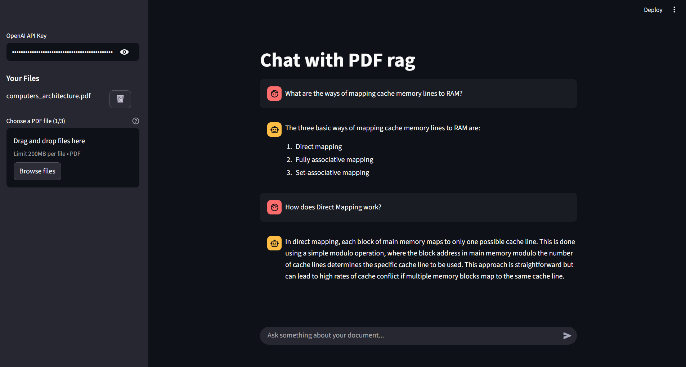

# 📄 PDF Q&A with RAG

An application that enables asking questions about PDF documents using RAG (Retrieval Augmented Generation) technology.



## 📝 Requirements

- **OpenAI API Key** - Required to access language models and embeddings
- **UV** - Fast Python dependency manager ([installation guide](https://docs.astral.sh/uv/getting-started/installation/))

## ✨ Features

- **📤 PDF Document Upload** - Upload and index PDF documents for questioning
- **💬 Chat with Documents** - Ask questions and get answers based on document content
- **📋 Session Management** - Maintains conversation history across sessions `(Not fully implemented yet)`
- **🔄 Development and Production Modes** - Different configurations for development and production environments
- **📱 Responsive Interface** - Adapts to different screen sizes

## 🚀 Quick Start

### 🛠️ Development Mode

```bash
# Install dependencies
uv sync

# Run the Streamlit application
streamlit run src/app.py
```

The application will be available at: http://localhost:8501

### 🐳 Production Mode

```bash
# Run all services (Redis, ChromaDB, Application)
docker-compose up --build
# or using podman
podman compose up --build
```


## ⚙️ How It Works

### 🛠️ Development Mode
- JSON file-based session manager
- Local ChromaDB storage
- No external service dependencies

### 🐳 Production Mode
- Redis backend for session management
- ChromaDB as external service
- All services run in Docker containers

## 🌐 Ports

- **8501** - Streamlit Application
- **6379** - Redis (production mode only)
- **8000** - ChromaDB (production mode only)

## 🛠️ Technologies

- **🐍 Python 3.12+** - Programming language
- **🎯 Streamlit** - Web application framework
- **🔗 LangChain** - Framework for working with language models
- **🗄️ ChromaDB** - Vector database
- **🔴 Redis** - Session storage and caching (production)
- **🤖 OpenAI API** - Language models and embeddings
- **📦 UV** - Python dependency management
- **🐳 Docker/podman** - Containerization (production)

##  🚧 Coming soon

- [ ] Graph RAG implementation
- [ ] Persistent chat histories
- [ ] Improved authentication method
- [ ] Support for other LLMs
- [ ] Enhanced file upload support (multiple formats)